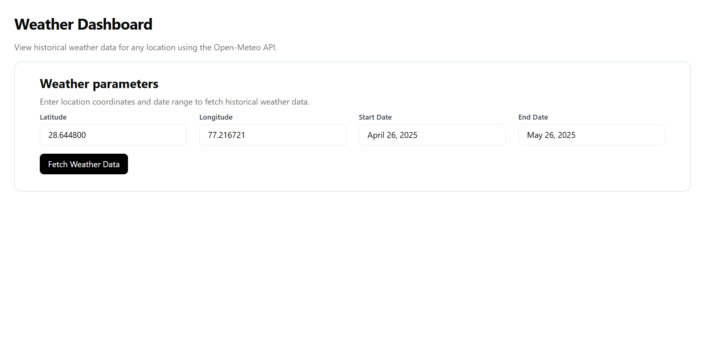
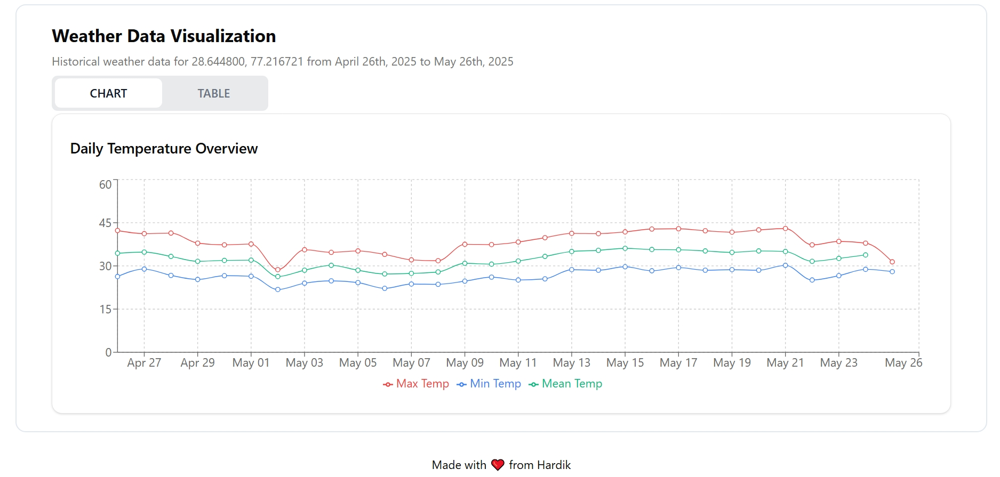
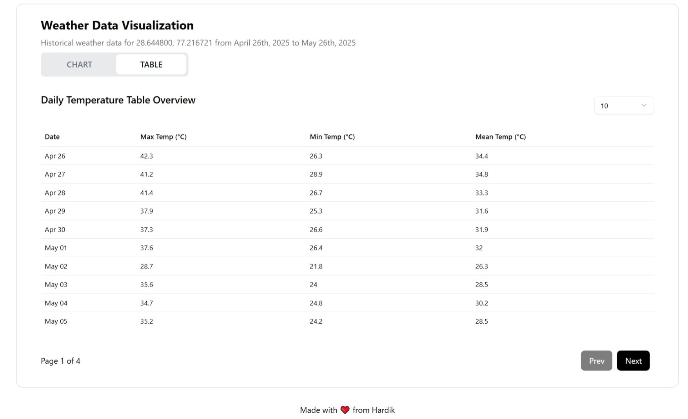

---

## 🌦️ Weather Dashboard

A responsive React application to fetch and visualize historical weather data using the **Open-Meteo Historical Weather API**. Users can input geographic coordinates and a date range to view weather statistics in **interactive charts** and a **paginated table**.

---

### 🚀 Features

* 📍 Latitude & Longitude input with validation
* 📅 Date pickers for start and end dates
* 🔁 **Loading state** shown while fetching data
* 📊 Line chart visualization using ShadCN + Recharts
* 📋 Paginated table view (10 / 20 / 50 rows)
* ✅ Built with **Vite**, **React**, and **Tailwind CSS**

---

### 📸 Screenshots

| Dashboard Form             | Weather Chart                | Paginated Table              |
| -------------------------- | ---------------------------- | ---------------------------- |
|  |  |  |

---

### 🛠️ Tech Stack

* **Framework**: React (via Vite)
* **Styling**: Tailwind CSS + ShadCN UI
* **Charting**: Recharts (ShadCN wrapped)
* **Table**: ShadCN table with TanStack Table Core
* **API**: [Open-Meteo Historical API](https://open-meteo.com/en/docs/historical-weather-api)

---

### 📦 Installation

```bash
git clone https://github.com/hardik1452/open_meteo_weather_dashboard.git
cd open_meteo_weather_dashboard
npm install
```

---

### 🧪 Development Server

```bash
npm run dev
```

---

### 📋 Usage Instructions

1. **Enter Latitude & Longitude**

   * Latitude must be between `-90` and `90`
   * Longitude must be between `-180` and `180`

2. **Pick Start & End Dates**

   * Must be valid past dates
   * Start date must be earlier than end date

3. **Click “Fetch Weather Data”**

   * Triggers API request
   * Displays weather data in chart and table views

---

### 📈 Weather Parameters Used

The following **daily parameters** are fetched:

* `temperature_2m_max`
* `temperature_2m_min`
* `temperature_2m_mean`
* `apparent_temperature_max`
* `apparent_temperature_min`
* `apparent_temperature_mean`

---

### ✅ Validation & UX

* Fields must be filled
* Coordinates must be within valid range
* Dates must be valid & in the past
* Inline error messages shown for invalid fields
* Submit button is disabled & shows a loading state during API fetch

---

### 📂 Folder Structure

```
src/
├── Components/
│   ├── ui/
│   │   ├── card.jsx            # ShadCN card wrapper
│   │   ├── chart.jsx           # ShadCN-based chart UI
│   │   ├── select.jsx          # Dropdown for pagination
│   │   └── table.jsx           # ShadCN table wrapper
│   ├── Button.jsx              # Reusable button
│   ├── Dashboard.jsx           # Main input form
│   ├── DatePickerInput.jsx     # Controlled date picker
│   ├── LabelledInput.jsx       # Labeled input field
│   ├── DataChartAndTable.jsx   # Renders chart + table together
│   ├── ViewTabs.jsx            # Tab switcher for chart/table
│   ├── WeatherChart.jsx        # Recharts line chart
│   └── WeatherTable.jsx        # Paginated data table
├── App.jsx
├── main.jsx
└── index.css
```

---

### 🔌 Sample API Request

```
https://archive-api.open-meteo.com/v1/archive?latitude=28.644800&longitude=77.216721&start_date=2025-04-24&end_date=2025-05-24&daily=temperature_2m_max,temperature_2m_min,...&timezone=auto
```

---
